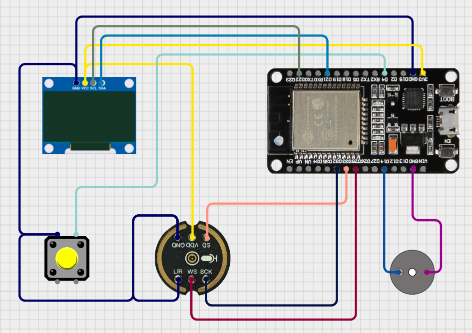

# MicroPython AI Assistant

Reusable MicroPython voice assistant library for ESP32-class boards.

Repository: https://github.com/eduardopereira-inpe/micropython-aiassistent

This project captures audio from an INMP441 microphone, sends it to OpenAI transcription, generates a chat response, and renders status/output on an SSD1306 OLED display with optional buzzer feedback.

## Highlights

- Library-first architecture under `src/assistant`
- Domain-oriented package organization (`assistant.audio`, `assistant.llm`, etc.)
- Runnable examples under `src/examples`
- UI messages externalized in JSON (`assistant/ui/messages.json`)
- Network/memory diagnostics for constrained MicroPython environments
- Initial `manifest.py` for future `mip` packaging

## Repository Structure

```text
src/
  assistant/
    __init__.py
    config.py
    app/
      __init__.py
      application.py
    ui/
      __init__.py
      ui.py
      messages.json
    audio/
      __init__.py
      service.py
      transcriber.py
      i2s_microphone.py
      wav.py
      interfaces.py
      config.py
    chat/
      __init__.py
      service.py
    display/
      __init__.py
      emotion_display.py
      display_callback.py
      ssd1306.py
    llm/
      __init__.py
      openai.py
      ollama.py
      stream_client.py
    buzzer/
      __init__.py
      player.py
      melodies.py
      notes.py
    network/
      __init__.py
      wifi.py
    utils/
      __init__.py
      dotenv.py
      asyncinput.py
  examples/
    main.py
    main_test.py
    main_old.py
    button_demo.py

manifest.py
README.md
```

## Hardware

- ESP32 board running MicroPython
- INMP441 I2S microphone
- SSD1306 OLED display (I2C)
- Push button
- Optional passive buzzer

### Circuit Example
[](./images/circuit_example.jpeg)

### Diagram Connection

[](./images/circuit_diagram_example.png)


### Running

[](https://www.youtube.com/shorts/SIbHdoIIevs)


https://github.com/user-attachments/assets/03c58044-3934-4cdb-bfd8-762c81a9f5d3


## Software Requirements

MicroPython firmware/modules compatible with:

- `uasyncio`
- `urequests`
- `ujson`
- `machine`
- `network`
- `ssl`
- `socket`

## Setup

### 1) Clone repository

```bash
git clone https://github.com/eduardopereira-inpe/micropython-aiassistent.git
cd micropython-aiassistent
```

### 2) Create `env.txt` on device

Create `env.txt` at device root with:

```text
API_KEY=your_openai_api_key
WIFI_SSID=your_wifi_name
WIFI_PASS=your_wifi_password
```

`assistant.config` loads this file and exposes:

- `API_KEY`
- `SSID`
- `PASSWORD`

### 3) Deploy to board

Copy `src/assistant` and `src/examples` to your device filesystem.

Example with `mpremote`:

```bash
mpremote connect auto fs cp -r src/assistant :/
mpremote connect auto fs cp -r src/examples :/
mpremote connect auto fs cp env.txt :/
```

## Running

### Main assistant app

Run `examples/main.py` on device, for example:

```bash
mpremote connect auto run src/examples/main.py
```

Or from REPL:

```python
import uasyncio as asyncio
from examples.main import main

asyncio.run(main())
```

### Button demo (transcription only)

```bash
mpremote connect auto run src/examples/button_demo.py
```

## Core Entry Points

- App orchestrator: `assistant.app.application.AssistantApplication`
- UI controller: `assistant.ui.ui.AssistantUI`
- Audio flow: `assistant.audio.service.AudioService`
- Chat flow: `assistant.chat.service.ChatService`
- OpenAI chat client: `assistant.llm.openai.OpenAI`
- OpenAI stream transcription client: `assistant.llm.stream_client.OpenAIStreamClient`

## Import Convention

All internal imports use absolute package paths:

```python
from assistant.audio.service import AudioService
from assistant.display.emotion_display import EmotionDisplay
from assistant.llm.openai import OpenAI
from assistant.network.wifi import conectar_wifi
```

## Memory/Network Notes (ESP32)

The project includes mitigations for constrained RAM and unstable links:

- TLS/post diagnostics in transcription and chat clients
- Retry strategy for transient socket failures
- I2S mic buffer release before TLS-heavy operations
- Streaming mode that avoids accumulating full chat response in RAM

If issues occur, inspect serial logs with prefixes:

- `[openaistream]`
- `[openai]`
- `[audio]`

## Packaging (mip)

Current `manifest.py`:

```python
metadata(
    version="0.1.0",
    description="MicroPython assistant library",
)

package("assistant", base_path="./src")
```

## Status

The project is under active development and now follows a reusable library layout with clear separation between framework code and runnable examples.
